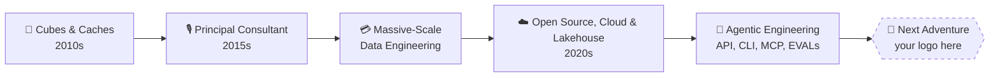

```mermaid
flowchart LR
    A["🦖 Cubes & Caches<br/>2010s"] --> B["🎙️ Principal Consultant<br/>2015s"]
    B --> C["💳 Massive-Scale<br/>Data Engineering"]
    C --> D["☁️ Open Source, Cloud & Lakehouse<br/>2020s"]
    D --> E["🤖 Agentic Engineering<br/>API, CLI, MCP, EVALs"]
    E --> F{{"🚀 Next Adventure<br/>your logo here"}}

    style F stroke-dasharray: 5 5
```
