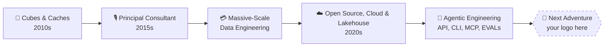

<h1 align="center">I make data do tricks so AI doesn't hallucinate.</h1> 
 <em>15+ years of turning enterprise chaos into context a model can actually trust.</em> 
 

 <em>Learn interactively with my notes and simulations:</em> 
 

  <!-- Calm Data & AI Button -->
  
  
  <!-- Reinforcement Learning Button -->
  

  <!-- Tidepool data intelligence -->
  
  

